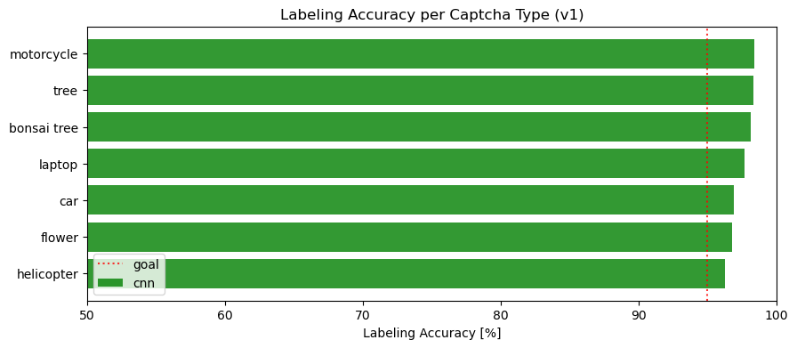
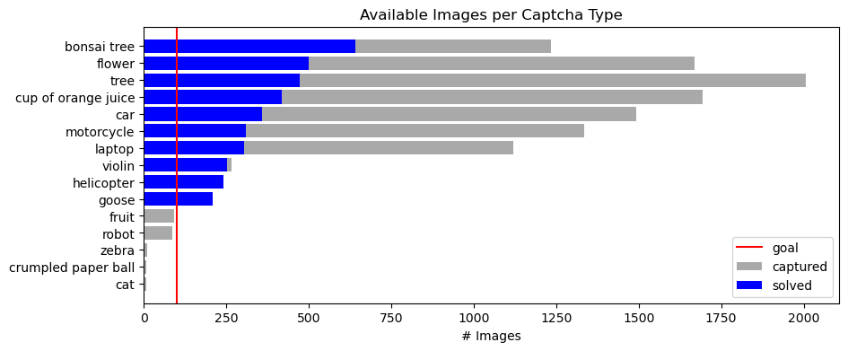

# hcaptcha-solver


a lightweight Python library for solving hCaptcha challenges with selenium and neural networks

## Installation

```bash
pip install hcaptcha-solver
```

## Usage

```python
from hcaptcha_solver import hcaptcha_solver
from selenium import webdriver

# create Captcha_Solver object to load ML models
captcha_solver = hcaptcha_solver.Captcha_Solver()

# create webdriver and access website with hCaptcha
options = webdriver.ChromeOptions()
options.add_experimental_option('prefs', {'intl.accept_languages': 'en,en_US'}) # set to english
driver = webdriver.Chrome(options=options)
driver.get("https://accounts.hcaptcha.com/demo")

# check for hCaptcha
captcha_solver.is_captcha_present(driver)

# solve hCaptcha
captcha_solver.solve_captcha(driver)

```

## Functionality

Only v1 hCaptchas are supported - any other captcha types will be skipped.
The correct images are selected using Convolutional Neural Networks trained on labeled hCaptcha data.
The models are chosen by inspecting the captcha header, so the language has to be english in order for the matching to work.

The package features models for a handful of hCaptcha tasks. The currently available models and their labeling accuracies are visualized in the figure below. Note that the accuracy was measured on training data and is therefore inflated.

The model availability and performance will be improved over time.

### Current Model Labeling Performance


### Current Data Availability


## Contributing

Pull requests are welcome. For major changes, please open an issue first
to discuss what you would like to change.

To help collecting captchas, run `dev/main.ipynb` and submit the results. In this notebook you can also explore the data availability and train models.

> _updated 13/08/2023_
